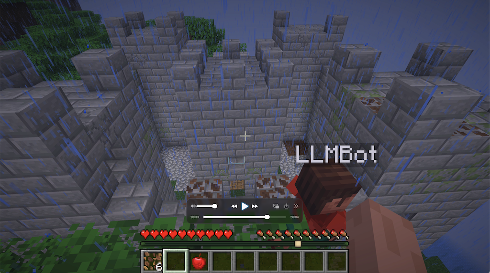

[](https://jitpack.io/#umjammer/mc-mcp-server)
[](https://github.com/umjammer/mc-mcp-server/actions/workflows/maven.yml)
[](https://github.com/umjammer/mc-mcp-server/actions/workflows/codeql.yml)


# mc-mcp-server

 &nbsp;&nbsp;claude opus5.5 build the castle

⛏️ Model Context Protocol server for Minecraft.

## Install

 * [maven](https://jitpack.io/#umjammer/mc-mcp-server)

## Usage

the bot joins a minecraft java edition **1.21.7** server as an offline player,
so the server needs `online-mode=false`. op the bot (`/op LLMBot`) if you want it to run commands.

```
java -cp ... vavi.games.minecraft.mcp.MinecraftBotMCP [-host localhost] [-port 25565] [-username LLMBot]
```

### tools

| name | description |
|------|-------------|
| get-position | position, game mode and health |
| move-to-position | walks to a position with path finding (walk, step up, drop down) |
| look-at | turns the head to a position |
| jump | jumps |
| move-in-direction | walks forward/back/left/right for a duration |
| list-inventory, find-item | inventory contents |
| equip-item | moves an item to the hand, off-hand or an armor slot |
| place-block | places the held block (walks within reach if needed) |
| dig-block | digs a block, takes the vanilla breaking time in survival |
| get-block-info, find-block | reads the bot's copy of the loaded chunks |
| find-entity | the nearest entity by type or player name |
| send-chat | chat, or a command when it starts with `/`; returns the server's response messages |
| build-blocks | places a list of blocks in one call: equips items, orders placements so each block has support, walks within reach, builds temporary pillars for high positions, resumable |
| fill-region | fills a box (solid, hollow or walls) the same way |
| clear-region | digs a box from the top (optionally only matching blocks, e.g. logs), with the best tool in the inventory |
| scan-area | height map of an area (optionally ignoring trees) for planning |

the bot walks through leaves by digging them, and picks the best tool (axe, pickaxe, shovel, hoe) for digging.

### game data

`src/main/resources/vavi/games/minecraft/mcp/{blocks.tsv,items.txt}` are generated from the vanilla server's data reports
(`java -DbundlerMainClass=net.minecraft.data.Main -jar server.jar --reports`)
and [minecraft-data](https://github.com/PrismarineJS/minecraft-data)'s block collision shapes.
regenerate them when mcprotocollib's protocol version changes.

## References

 * https://github.com/GeyserMC/MCProtocolLib
 * https://github.com/modelcontextprotocol/java-sdk
 * https://github.com/yuniko-software/minecraft-mcp-server

## TODO
